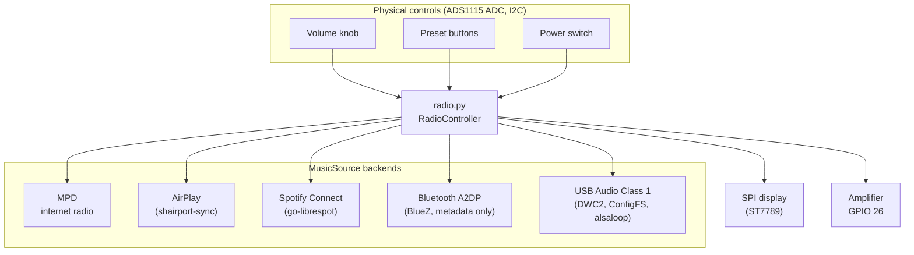
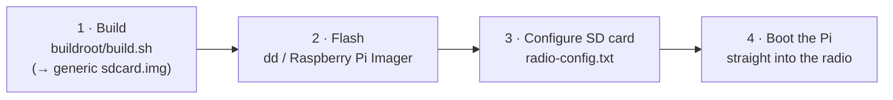

# Raspberry Pi Radio

Raspberry Pi Radio turns a Raspberry Pi into a **kitchen-style internet radio
and streaming speaker** with real, tactile controls. Power it on and it boots
straight into the radio — no desktop, no login, no app to launch. Turn the knob
to change the volume, press a button to switch stations, and stream to it from
your phone over AirPlay, Spotify Connect, Bluetooth, or USB Audio.

Under the hood it is a small Python application that runs on a **minimal,
fast-booting [Buildroot](https://buildroot.org/) appliance image** for the
**Raspberry Pi 3A+**. The image is purpose-built: it boots in seconds into the
radio and nothing else.

**New here? Start with the [documentation map](#documentation--where-to-find-what)
below** — it points you to the right guide whether you want to build your own
radio, flash a prebuilt image, or work on the code.

## Features

- **Internet Radio Streaming:** Play and manage your favorite online radio stations.
- **AirPlay Receiver:** Stream music wirelessly from your iOS devices.
- **Spotify Connect:** Control and play music directly from the Spotify app.
- **Bluetooth A2DP:** Stream audio from any phone/tablet over Bluetooth — the
  radio is always discoverable and pairs without a PIN when nothing is connected.
- **USB Audio Class receiver:** Use the radio as a stereo UAC1 sound card over
  the Pi 3A+ USB data port (data-only wiring; USB VBUS must not be connected).
- **Extensible Music Sources:** The system is modular, so new music sources are
  easy to add (see [`doc/adding-a-music-source.md`](doc/adding-a-music-source.md)).
- **Display Support:** Built-in support for an SPI-connected display, with room
  to add other display types.
- **Hardware Controls:** A physical volume knob and preset buttons for a tactile
  radio experience.
- **Appliance image:** Ships as a minimal, fast-booting Buildroot image that
  boots straight into the radio.
- **Safe A/B firmware updates:** Upload a versioned `.swu` from the web
  interface; updates write only the inactive slot, retain configuration, use a
  health-checked trial boot, and automatically return to the previous firmware
  when the trial is unhealthy.
- **Web administration interface:** A local, password-protected web UI (port
  8080) to view status, edit presets, toggle music sources, set the device
  name/clock, tune the display, configure a parametric equalizer, pick the sound
  card and maximum volume, view
  read-only Bluetooth adapter status, change WiFi/static IP, manage firmware,
  back up or restore persistent device data, and restart or reboot — see
  [`doc/web-interface.md`](doc/web-interface.md).

## How it works

`radio.py` runs a `RadioController` that ties everything together: the playback
backends, the display, and the analog controls. Every backend implements the
same small [`MusicSource`](lib/music_source.py) interface, so the controller
treats internet radio, AirPlay, Spotify, Bluetooth, and USB Audio interchangeably.

## First boot: configure the SD card

The image includes an editable **`radio-config.txt`** on the SD card's small FAT
boot partition. This is the easiest way to get a freshly flashed radio onto your
network:

1. Flash `sdcard.img`, then reinsert or remount the SD card on your computer.
2. Open the boot partition and edit the existing `radio-config.txt` with a plain
   text editor—do not rename it.
3. At minimum, replace `MyNetwork` and `my-wifi-password` with your WiFi SSID and
   password. You can also replace the `changeme` hostname and root password,
   select your timezone/country, or explicitly enable SSH.
4. Safely eject the card and boot the Pi. With the shipped values, the web
   interface is available at `http://changeme.local:8080` after WiFi connects.
5. Use the web interface for subsequent device, network, station, display and
   audio configuration. SSH is disabled by default.

Provisioning is **one-shot**: after applying the active settings, the radio
comments their lines out in `radio-config.txt`. To apply a boot setting again,
edit its value on the boot partition, remove the leading `#`, and reboot. See
[`doc/buildroot.md`](doc/buildroot.md#provisioning-a-prebuilt-image-from-the-sd-card-radio-configtxt)
for every supported key.

## Update the firmware

Obtain a trusted `kitchen-radio-<version>.swu`, log in to the web interface, open
**Maintenance**, and choose **Update firmware**. The guided overlay asks for the
administrator password, the update file, and final confirmation. It then uploads,
validates, installs, and reboots automatically while reporting progress. After
the device reconnects, the overlay waits for the health-checked trial to be
accepted. Repeated unhealthy boots make U-Boot return to the previous accepted
slot, and the overlay reports that recovery. Maintenance can also start a
password-confirmed trial of the retained compatible firmware with **Switch to
previous firmware**.

Firmware packages are **unsigned**, so SHA-256 detects corruption but does not
prove authenticity. Obtain packages through a trusted channel and use the
plain-HTTP administration interface only on a trusted LAN. The complete upload,
activation, rollback and unreachable-UI recovery procedure is in
[`doc/firmware-updates.md`](doc/firmware-updates.md).

The media backends (shairport-sync, nqptp, go-librespot, BlueZ/bluez-alsa, and
the ALSA `alsaloop`/libsamplerate USB bridge) are compiled from source into the
appliance image. For the service layout and how these are supervised, see
[`doc/buildroot.md`](doc/buildroot.md).

## Hardware at a glance

- **Raspberry Pi 3A+** — the appliance image targets this board specifically
  (32-bit ARMv7, 512 MB). Other Pi models are not supported by the image.
- **SPI-connected display** (1.69" ST7789) for now-playing info and station logos.
- **ADS1115 ADC** (I2C) reading a volume potentiometer, a button ladder, and a
  power switch.
- **I2S DAC / amplifier** board (e.g. IQaudIO, HiFiBerry, ESS I-SABRE/Katana,
  or MERUS)
  driving the speaker.

Base-radio wiring and ADS1115 controls are in
[`doc/hardware.md`](doc/hardware.md). Every selectable output has a complete,
color-coded 40-pin map in [`doc/sound-devices.md`](doc/sound-devices.md).
No 3D-printable case or speaker files ship with this repository.

## Get started

You build a generic `sdcard.img` on an **x64/amd64 Debian or Ubuntu host**
(you cannot build it on macOS, Windows, or the Pi itself), flash it, edit its
boot-partition configuration, and boot. The helper under
[`buildroot/`](buildroot/) does the build work.

- **Never built an embedded image before?** Follow the step-by-step
  [`doc/build-from-scratch.md`](doc/build-from-scratch.md) — no prior
  embedded-Linux experience assumed.
- **Comfortable with Buildroot?** The scripted and manual quick-start lives in
  [`buildroot/README.md`](buildroot/README.md).
- **Just flashed a prebuilt image and want to set WiFi/hostname without
  rebuilding?** Edit `radio-config.txt` on the SD card's boot partition — see
  [`doc/buildroot.md`](doc/buildroot.md#provisioning-a-prebuilt-image-from-the-sd-card-radio-configtxt).

## Documentation — where to find what

Pick the trail that matches your goal. The full per-file index lives in
[`doc/README.md`](doc/README.md).

### 🛠️ I want to build and set up my own radio

- [`doc/build-from-scratch.md`](doc/build-from-scratch.md) — beginner's
  step-by-step guide from a fresh download to a flashed SD card.
- [`doc/hardware.md`](doc/hardware.md) — base wiring, display, USB gadget, and
  ADS1115 controls.
- [`doc/sound-devices.md`](doc/sound-devices.md) — supported output devices,
  each with its own color-coded 40-pin map, conflicts and validation.
- [`doc/alsa-audio-path.md`](doc/alsa-audio-path.md) — the end-to-end ALSA
  routing picture: source convergence on `default`, the layered parametric-EQ
  and `Radio Volume` softvol/dmix stages, the Bluetooth/USB bridges, stable-card
  routing and worked `asound.conf` examples.
- [`doc/equalizer.md`](doc/equalizer.md) — use, tune and troubleshoot the
  ten-band parametric EQ; includes its ALSA/LADSPA developer architecture.
- [`doc/stations.md`](doc/stations.md) — add / edit the preset radio stations.
- [`doc/web-interface.md`](doc/web-interface.md) — the local web admin UI (port
  8080): dashboard, editing presets/sources, device settings, firmware, and
  maintenance.
- [`doc/firmware-updates.md`](doc/firmware-updates.md) — operator workflow for
  firmware upload, progress, trial activation, rollback, and recovery.
- [`doc/bluetooth.md`](doc/bluetooth.md) — pairing a phone (no PIN) and how the
  Bluetooth source behaves.
- [`doc/usb-audio.md`](doc/usb-audio.md) — USB sound-card usage, source switching,
  validation and troubleshooting; wiring is in [`doc/hardware.md`](doc/hardware.md#usb-audio-gadget-wiring).
- [`doc/logos.md`](doc/logos.md) — how station logos are rendered and how to add
  your own.

### 📦 I'm building, flashing or debugging the image

- [`buildroot/README.md`](buildroot/README.md) — the appliance image quick-start:
  build a generic image with `build.sh`, flash it, then edit `radio-config.txt`.
- [`doc/buildroot.md`](doc/buildroot.md) — the authoritative reference: scripted
  & manual build, flash, on-target validation, `radio-config.txt` provisioning,
  A/B image/update internals, logging & debugging, service layout, recovery, and
  design constraints.
- [`doc/persistent-data.md`](doc/persistent-data.md) — complete inventory of the
  shared data partition, why each item persists, and how build/boot/runtime writes
  are guaranteed to reach partition `p4`.
- [`doc/firmware-update-architecture.md`](doc/firmware-update-architecture.md) —
  reusable A/B update design: Buildroot, U-Boot, SWUpdate, health acceptance,
  fallback, runtime tooling, and porting guidance.
- [`doc/display-test.md`](doc/display-test.md) — standalone display smoke test &
  wiring troubleshooting.

### 💻 I'm a developer or contributor

- [`CONTRIBUTING.md`](CONTRIBUTING.md) — how to set up, run the checks, and open
  a pull request.
- [`doc/development.md`](doc/development.md) — local setup, running the tests,
  coverage, linting (`ruff`), type checks (`mypy`), and the CI pipeline.
- [`doc/adding-a-music-source.md`](doc/adding-a-music-source.md) — add a new
  `MusicSource` playback backend.
- [`doc/equalizer.md`](doc/equalizer.md) — EQ persistence, DSP/ALSA topology,
  implementation boundaries, target qualification and focused tests.
- [`doc/hardware.md`](doc/hardware.md) — the hardware the code drives.
- [`SECURITY.md`](SECURITY.md) — how to report a vulnerability and the device's
  threat model.
- [`CODE_OF_CONDUCT.md`](CODE_OF_CONDUCT.md) — community expectations.

### 🎨 Assets & licensing

- [`doc/assets.md`](doc/assets.md) — the vendored UI font and station logos:
  provenance, licensing, checksums, and how to replace them.
- [`doc/logos.md`](doc/logos.md) — preparing and adding station logo artwork.

### 📓 Project history

- [`CHANGELOG.md`](CHANGELOG.md) — release notes / version history, including
  the release checklist.

## License

This project is released under the [MIT License](LICENSE). The Buildroot image
compiles its media backends (shairport-sync, nqptp, go-librespot, and the
Bluetooth stack BlueZ + bluez-alsa) from source under their own upstream
licenses. The repository itself vendors only a UI font (Apache-2.0) and station
logos (broadcaster trademarks) — see [`doc/assets.md`](doc/assets.md).

