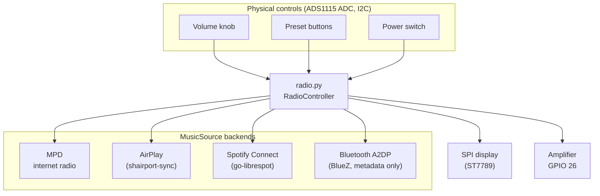
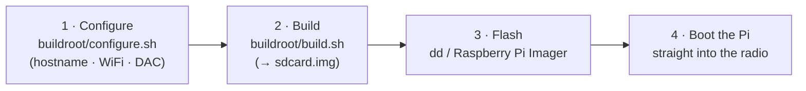

# Raspberry Pi Radio

Raspberry Pi Radio turns a Raspberry Pi into a **kitchen-style internet radio
and streaming speaker** with real, tactile controls. Power it on and it boots
straight into the radio — no desktop, no login, no app to launch. Turn the knob
to change the volume, press a button to switch stations, and stream to it from
your phone over AirPlay, Spotify Connect, or Bluetooth.

Under the hood it is a small Python application that runs on a **minimal,
fast-booting [Buildroot](https://buildroot.org/) appliance image** for the
**Raspberry Pi 3A+**. The image is purpose-built: it boots in seconds into the
radio and nothing else.

**New here? Start with the [documentation map](#documentation--where-to-find-what)
below** — it points you to the right guide whether you want to build your own
radio, flash a prebuilt image, or work on the code.

## Features

- **Internet Radio Streaming:** Play and manage your favorite online radio stations.
- **AirPlay Receiver:** Stream music wirelessly from your iOS devices.
- **Spotify Connect:** Control and play music directly from the Spotify app.
- **Bluetooth A2DP:** Stream audio from any phone/tablet over Bluetooth — the
  radio is always discoverable and pairs without a PIN when nothing is connected.
- **Extensible Music Sources:** The system is modular, so new music sources are
  easy to add (see [`doc/adding-a-music-source.md`](doc/adding-a-music-source.md)).
- **Display Support:** Built-in support for an SPI-connected display, with room
  to add other display types.
- **Hardware Controls:** A physical volume knob and preset buttons for a tactile
  radio experience.
- **Appliance image:** Ships as a minimal, fast-booting Buildroot image that
  boots straight into the radio.

## How it works

`radio.py` runs a `RadioController` that ties everything together: the playback
backends, the display, and the analog controls. Every backend implements the
same small [`MusicSource`](lib/music_source.py) interface, so the controller
treats internet radio, AirPlay, Spotify, and Bluetooth interchangeably.

The media backends (shairport-sync, nqptp, go-librespot, and the BlueZ/bluez-alsa
Bluetooth stack) are compiled from source into the appliance image. For the
service layout and how these are supervised on the target, see
[`doc/buildroot.md`](doc/buildroot.md).

## Hardware at a glance

- **Raspberry Pi 3A+** — the appliance image targets this board specifically
  (32-bit ARMv7, 512 MB). Other Pi models are not supported by the image.
- **SPI-connected display** (1.69" ST7789) for now-playing info and station logos.
- **ADS1115 ADC** (I2C) reading a volume potentiometer, a button ladder, and a
  power switch.
- **I2S DAC / amplifier** board (e.g. IQaudIO DAC+, HiFiBerry DAC+, MERUS amp)
  driving the speaker.

Full wiring diagram, GPIO pinout, ADS1115 channel map and DAC overlays are in
[`doc/hardware.md`](doc/hardware.md). No 3D-printable case or speaker files ship
with this repository.

## Get started

You build a single `sdcard.img` on an **x64/amd64 Debian or Ubuntu host**
(you cannot build it on macOS, Windows, or the Pi itself), flash it, and boot.
Two helper scripts under [`buildroot/`](buildroot/) do the heavy lifting.

- **Never built an embedded image before?** Follow the step-by-step
  [`doc/build-from-scratch.md`](doc/build-from-scratch.md) — no prior
  embedded-Linux experience assumed.
- **Comfortable with Buildroot?** The scripted and manual quick-start lives in
  [`buildroot/README.md`](buildroot/README.md).
- **Just flashed a prebuilt image and want to set WiFi/hostname without
  rebuilding?** Edit `radio-config.txt` on the SD card's boot partition — see
  [`doc/buildroot.md`](doc/buildroot.md#provisioning-a-prebuilt-image-from-the-sd-card-radio-configtxt).

## Documentation — where to find what

Pick the trail that matches your goal. The full per-file index lives in
[`doc/README.md`](doc/README.md).

### 🛠️ I want to build and set up my own radio

- [`doc/build-from-scratch.md`](doc/build-from-scratch.md) — beginner's
  step-by-step guide from a fresh download to a flashed SD card.
- [`doc/hardware.md`](doc/hardware.md) — wiring diagram, GPIO/overlays, ADS1115
  map, DAC selection.
- [`doc/stations.md`](doc/stations.md) — add / edit the preset radio stations.
- [`doc/bluetooth.md`](doc/bluetooth.md) — pairing a phone (no PIN) and how the
  Bluetooth source behaves.
- [`doc/logos.md`](doc/logos.md) — how station logos are rendered and how to add
  your own.

### 📦 I'm building, flashing or debugging the image

- [`buildroot/README.md`](buildroot/README.md) — the appliance image quick-start:
  `configure.sh` (hostname/WiFi/root password/DAC) and `build.sh`.
- [`doc/buildroot.md`](doc/buildroot.md) — the authoritative reference: scripted
  & manual build, flash, on-target validation, `radio-config.txt` provisioning,
  logging & debugging, defconfig/service layout, self-recovery, and design
  constraints.
- [`doc/display-test.md`](doc/display-test.md) — standalone display smoke test &
  wiring troubleshooting.

### 💻 I'm a developer or contributor

- [`doc/development.md`](doc/development.md) — local setup, running the tests,
  coverage, linting (`ruff`), type checks (`mypy`), and the CI pipeline.
- [`doc/adding-a-music-source.md`](doc/adding-a-music-source.md) — add a new
  `MusicSource` playback backend.
- [`doc/hardware.md`](doc/hardware.md) — the hardware the code drives.

### 🎨 Assets & licensing

- [`doc/assets.md`](doc/assets.md) — the vendored UI font and station logos:
  provenance, licensing, checksums, and how to replace them.
- [`doc/logos.md`](doc/logos.md) — preparing and adding station logo artwork.

### 📓 Project history

- [`CHANGELOG.md`](CHANGELOG.md) — release notes / version history, including
  the release checklist.

## License

This project is released under the [MIT License](LICENSE). The Buildroot image
compiles its media backends (shairport-sync, nqptp, go-librespot, and the
Bluetooth stack BlueZ + bluez-alsa) from source under their own upstream
licenses. The repository itself vendors only a UI font (Apache-2.0) and station
logos (broadcaster trademarks) — see [`doc/assets.md`](doc/assets.md).

