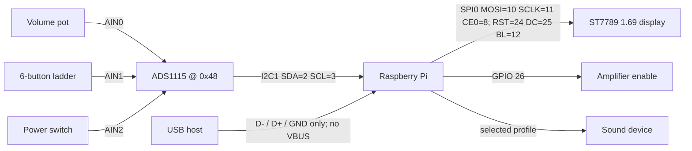
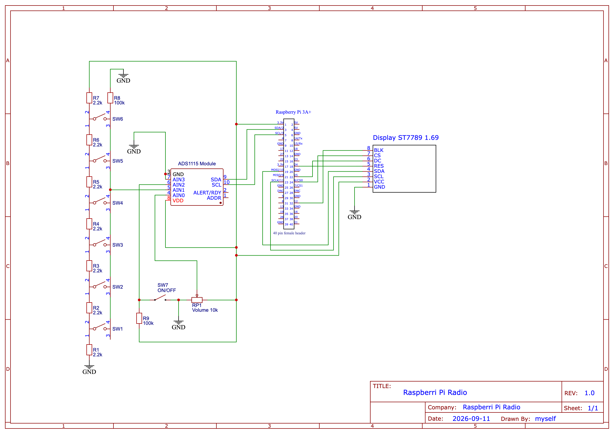

# Hardware & wiring

> **Status:** the base-radio pin and ADS1115 information below reflects the shipped
> `buildroot/external/board/radio/config.txt`, `radio.conf`, `display.conf` and
> the code. A text wiring diagram, base pin summary, and a full
> [schematic](#schematic) are included. No 3D-printable case files are part of
> this repository.

## GPIO pinout & wiring overview

GPIO numbers below are **BCM** (Broadcom) numbers — the scheme `radio.py` uses
(`GPIO.setmode(GPIO.BCM)`). **Physical pin** numbers refer to positions on the
40-pin header and are not interchangeable with BCM numbers.

| Function | Signal | BCM pin | Physical pin | Source |
| --- | --- | --- | --- | --- |
| Amplifier enable | Optional GPIO out | **26** | 37 | Profile-dependent; see sound-device pinout |
| Display reset | GPIO out (RST) | **24** | 18 | `display.conf rst` |
| Display data/command | GPIO out (DC) | **25** | 22 | `display.conf dc` |
| Display backlight | GPIO out (BL) | **12** | 32 | `display.conf bl` |
| Display SPI | MOSI | **10** | 19 | SPI0 (`dtparam=spi=on`) |
| Display SPI | SCLK | **11** | 23 | SPI0 |
| Display SPI chip select | CE0 (default) | **8** | 24 | `display.conf spi_device = 0` |
| ADS1115 (ADC) | I2C1 SDA | **2** | 3 | `dtparam=i2c_arm=on` |
| ADS1115 (ADC) | I2C1 SCL | **3** | 5 | `dtparam=i2c_arm=on` |
| Sound device | Profile-dependent | See [device pinouts](sound-devices.md#device-pinouts) | See device guide | Selected overlay |
| USB Audio input | USB D− / D+ / GND | — | USB-A contacts 2 / 3 / 4 | DWC2 / UAC1 gadget |
| Power / ground | 3V3 / 5V / GND | — | 1 / 2 / 6 (etc.) | — |

The shipped default uses the Pi's built-in headphone output and drives no
amplifier-enable GPIO. External sound devices can claim I2S, I2C and additional
GPIO. Complete 40-pin maps are therefore configuration-dependent. Choose a
profile first, then use its color-coded map in
[`sound-devices.md`](sound-devices.md#device-pinouts); do not infer a HAT's
wiring from this generic summary.

The GPIO pins use **3.3 V logic and are not 5 V tolerant**. Switch off all power
before wiring the header. The listed 5 V pins are power rails, not logic outputs;
do not use them to drive a GPIO signal.

### Block diagram

```
                          +--------------------------+
                          |     Raspberry Pi          |
                          |                           |
  Volume pot ── AIN0 ─┐   |  I2C1 (SDA=2, SCL=3) ─────┼──┐
  Button ladder AIN1 ─┼── ADS1115 ─────────────────── ┘  |
  Power switch  AIN2 ─┘   |                           |  (0x48)
                          |                           |
                          |  SPI0 (MOSI=10, SCLK=11,  |
  ST7789 1.69" display ───┼── CE0=8) + RST=24,        |
                          |  DC=25, BL=12              |
                          |                           |
  Amplifier enable  ──────┼── GPIO 26                 |
                          |                           |
  Sound device    ────────┼── profile-dependent       |
                          +--------------------------+
```



### Schematic



This schematic shows the **base-radio wiring** and matches the shipped defaults
in `display.conf` and `radio.conf` (cross-checked against the code):

- the 1.69" **ST7789 SPI display** (SDA/DIN→BCM 10, SCL/SCK→BCM 11, CS→CE0/BCM 8,
  DC→BCM 25, RES→BCM 24, BLK→BCM 12, VCC→3V3, GND→GND);
- the **ADS1115 ADC** on I2C1 (SDA→BCM 2, SCL→BCM 3, `0x48`) reading the volume
  potentiometer on **AIN0**, the six-button resistor ladder on **AIN1**, and the
  ON/OFF switch on **AIN2**.

It deliberately does **not** show a sound-device HAT or the optional
amplifier-enable GPIO (BCM 26): those are profile-dependent and each has its own
complete 40-pin map in [`sound-devices.md`](sound-devices.md#device-pinouts).
The exact discrete parts (resistor ladder, pot value, and the 3V3 reference
requirement) are described under
[Controls via ADS1115](#controls-via-ads1115-i2c-adc).


## USB audio gadget wiring

The Pi 3A+ USB-A connector is used in **peripheral** mode so a computer, phone
or tablet sees the radio as a USB sound card. This installation deliberately
uses a three-wire, data-only connection. **Do not connect USB power/VBUS.**

| USB 2.0 Type-A contact | Signal | Connection |
| --- | --- | --- |
| 1 | VBUS / +5 V | **Do not connect; leave disconnected and insulated** |
| 2 | D− | Host D− to Pi D− |
| 3 | D+ | Host D+ to Pi D+ |
| 4 | GND | Host GND to Pi GND |

```text
USB host                         Raspberry Pi 3A+ USB-A port
--------                         ----------------------------
VBUS / +5 V  (contact 1)   X     DO NOT CONNECT
D-           (contact 2)  ------ D-
D+           (contact 3)  ------ D+
GND          (contact 4)  ------ GND
```

The radio must continue to be powered through its intended, independent power
input. Connecting the host's VBUS to the independently powered Pi could
back-feed either supply. Use a purpose-made data-only cable/adapter or physically
remove and individually insulate the VBUS conductor. Never use an unmodified
USB-A-to-USB-A cable for this connection.

Do not identify conductors from color alone: colors are conventional, not a
guarantee. Verify the contacts and the absence of VBUS continuity with a
multimeter before connecting either powered device. Connector numbering also
looks mirrored between the contact and solder sides, so follow the signal names
and verify continuity rather than relying on an orientation sketch. Keep D+ and
D− together as a short twisted pair where practical; the common GND connection
is required for reliable signaling.

The boot setting `dtoverlay=dwc2,dr_mode=peripheral` dedicates the Pi 3A+ USB-A
connector to this gadget. It can no longer host a keyboard, storage device or
hub. Use WiFi/SSH (or a separately configured serial console) for recovery. See
[`usb-audio.md`](usb-audio.md) for operation and validation.


## Audio output

The built-in headphone jack is the default. The web interface's **Audio** page
(`/audio-hardware`) selects an external DAC or amplifier profile and updates its
overlay, ALSA route, mixer and optional amplifier-enable GPIO together; reboot
after applying it.

Start with [`sound-devices.md`](sound-devices.md): it has one self-contained
pinout table for every selectable device, including power guidance, GPIO
ownership, display/ADS1115 compatibility, expected ALSA card and mixer, and any
required rewiring. The longer manual recovery procedure for returning to the
built-in output is in [`analog-audio.md`](analog-audio.md).

## Controls via ADS1115 (I2C ADC)

Volume, the power switch, and the six station buttons are all read as analog
voltages through an **ADS1115** ADC on I2C1 (`adc_controller.py`). There are no
discrete GPIO lines for these inputs; the controller polls the ADC channels on a
fixed cadence (`ADC_POLL_INTERVAL`).

The I2C address defaults to `0x48` and is configurable in `radio.conf`
(`[adc] i2c_address`, parsed base-0 so `0x48` works). Verify the chip is present
with `i2cdetect -y 1`.

### Discrete parts and reference (from the [schematic](#schematic))

The controls are a small passive network around the ADS1115. The reference
build uses these components:

| Ref | Value | Role |
| --- | --- | --- |
| **RP1** | 10 kΩ potentiometer | Volume knob; wiper → **AIN0**, ends across 3V3 / GND. |
| **R1–R6** | 6 × 2.2 kΩ | Series resistor ladder for the six preset buttons **SW1–SW6**. |
| **R7** | 2.2 kΩ | Top-of-ladder series resistor into the 3V3 reference. |
| **R8** | 100 kΩ | Pull up for the button-ladder node feeding **AIN1**. |
| **SW7** | ON/OFF switch | Power switch sensed on **AIN2**. |
| **R9** | 100 kΩ | Pull up for the switch node feeding **AIN2**. |

Wiring and reference notes that keep the shipped calibration valid:

- **Power the ADS1115 `VDD` from the Pi 3V3 rail**, and feed the top of the pot
  and the button ladder from that **same 3V3**. The ADS1115 measures absolute
  voltage (default PGA ±6.144 V), so the calibration defaults below
  (`volume_max_input = 3282`, `button_max = 3100`) assume a ~3.3 V full scale.
  Using 5 V shifts every reading and breaks button/volume detection.
- **`ADDR`** is left at its default so the chip answers at `0x48`, matching
  `[adc] i2c_address`. Tie it to select another address only if you also change
  `radio.conf`.
- **`ALERT/RDY`** is intentionally left unconnected. The controller polls the
  channels on a fixed cadence (`ADC_POLL_INTERVAL`) rather than using the
  data-ready interrupt, so no GPIO line is needed for it.

### Channel map

| ADS1115 channel | Input | Read by | Behaviour |
| --- | --- | --- | --- |
| **AIN0** | Volume potentiometer | `read_adc_volume()` | Mapped linearly to `0..100` and pushed to the ALSA mixer. |
| **AIN1** | 6-button resistor ladder | `read_adc_buttons()` / `find_button()` | Voltage divides into 6 bands → buttons `1..6` (station presets). |
| **AIN2** | Power switch | `read_adc_switch()` | Switch is *on* when the reading is `<= 300` mV (`threshold`). |
| **AIN3** | *(unused)* | — | — |

Button indices `1..6` map to the station presets in file order — see
[`stations.md`](stations.md).

### Calibration (in `radio.conf [adc]`)

These constants are read from `radio.conf` and passed into `ADCController`
(they also exist as constructor defaults so the module runs stand-alone):

```ini
[adc]
i2c_address = 0x48            # ADS1115 I2C address (base-0)
volume_min_input = 0.93       # AIN0 reading (mV) mapped to volume 0
volume_max_input = 3282       # AIN0 reading (mV) mapped to volume 100
button_min = 100              # low end (mV) of the AIN1 button ladder
button_max = 3100             # high end (mV) of the AIN1 button ladder
button_tolerance = 150        # ± window (mV) for accepting a button band
switch_threshold = 300        # AIN2 is ON at or below this reading
```

The button ladder is divided into six equal bands between `button_min` and
`button_max`; a reading within `button_tolerance` of a band centre registers as
that button (`ADCController.find_button`). Adjust `button_tolerance` if presses
are missed or mis-detected.

The authenticated web interface provides a live **ADC debug & calibration** page
at `/debug/adc`. It streams AIN0–AIN3 raw millivolt readings and the player's
volume/button/power interpretation over a same-origin WebSocket. Captured values
are stored in `/etc/radio/adc.ini` and take effect after restarting the player.

## SPI display (1.69" ST7789)

The 240×280 SPI display is driven by `lib/display/`. SPI must be
enabled (`dtparam=spi=on`, above). The SPI clock is configurable via
`lib/display/display.conf` (`spi_freq`). `spi_bus` and `spi_device`
select the spidev endpoint. The shipped values `spi_bus = 0` and
`spi_device = 0` use `/dev/spidev0.0` (CE0/BCM 8). A sound-device profile may
require another chip select; follow its dedicated table in
[`sound-devices.md`](sound-devices.md#device-pinouts). `spi_device` selects a
hardware chip-select and is not an arbitrary BCM GPIO number.

## 3D-printable case

No 3D-printable case or speaker files are included in this repository. Any
enclosure is left to you — bring your own case.
