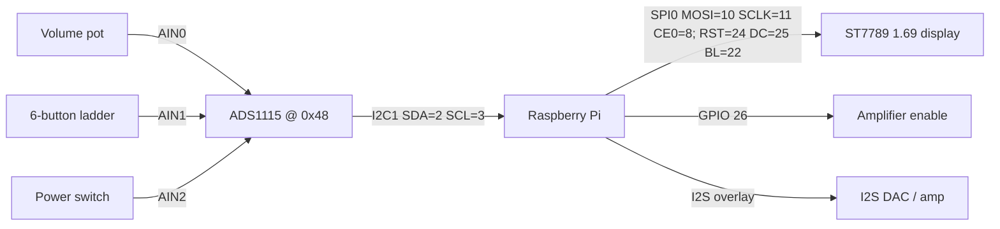

# Hardware & wiring

> **Status:** the pin/overlay/ADS1115 information below reflects the shipped
> `buildroot/external/board/radio/config.txt`, `radio.conf`, `display.conf` and
> the code. A text wiring diagram and GPIO pinout are included. No 3D-printable
> case files are part of this repository.

## GPIO pinout & wiring overview

All pin numbers below are **BCM** (Broadcom) numbering — the scheme
`radio.py` uses (`GPIO.setmode(GPIO.BCM)`).

| Function | Signal | BCM pin | Physical pin | Source |
| --- | --- | --- | --- | --- |
| Amplifier enable | GPIO out | **26** | 37 | `radio.conf [gpio] amp` |
| Display reset | GPIO out (RST) | **24** | 18 | `display.conf rst` |
| Display data/command | GPIO out (DC) | **25** | 22 | `display.conf dc` |
| Display backlight | GPIO out (BL) | **22** | 15 | `display.conf bl` |
| Display SPI | MOSI | **10** | 19 | SPI0 (`dtparam=spi=on`) |
| Display SPI | SCLK | **11** | 23 | SPI0 |
| Display SPI | CE0 | **8** | 24 | SPI0 |
| ADS1115 (ADC) | I2C1 SDA | **2** | 3 | `dtparam=i2c_arm=on` |
| ADS1115 (ADC) | I2C1 SCL | **3** | 5 | `dtparam=i2c_arm=on` |
| DAC / amp audio | I2S | — | — | `dtparam=i2s=on` + DAC overlay |
| Power / ground | 3V3 / 5V / GND | — | 1 / 2 / 6 (etc.) | — |

The I2S DAC uses the dedicated I2S pins claimed by its overlay
(`iqaudio-dacplus` by default); the amplifier is switched on/off via BCM 26.

### Block diagram

```
                          +--------------------------+
                          |     Raspberry Pi          |
                          |                           |
  Volume pot ── AIN0 ─┐   |  I2C1 (SDA=2, SCL=3) ─────┼──┐
  Button ladder AIN1 ─┼── ADS1115 ─────────────────── ┘  |
  Power switch  AIN2 ─┘   |                           |  (0x48)
                          |                           |
                          |  SPI0 (MOSI=10, SCLK=11,  |
  ST7789 1.69" display ───┼── CE0=8) + RST=24, DC=25, |
                          |          BL=22            |
                          |                           |
  Amplifier enable  ──────┼── GPIO 26                 |
                          |                           |
  I2S DAC / amp   ────────┼── I2S (overlay)           |
                          +--------------------------+
```




## Audio output (DAC / amplifier)

The shipped `buildroot/external/board/radio/config.txt` enables the required
interfaces and loads an I2S DAC overlay:

```
dtparam=i2c_arm=on
dtparam=i2s=on
dtparam=spi=on
dtparam=audio=off          # on-board audio disabled; the DAC/amp is used instead
dtoverlay=iqaudio-dacplus  # active DAC overlay (others are commented out)
```

Other DAC overlays are present but commented out in `config.txt`
(`merus-amp`, `hifiberry-dacplus`) — enable the one matching your board.

The ALSA mixer control the software drives is set in `radio.conf`:

```
[audio]
mixer = Digital
```

The Buildroot image ships a plain-passthrough `/etc/asound.conf` (dmix → DAC),
so no ALSA plugin needs to be installed.

## Amplifier enable (GPIO)

`radio.conf` controls a GPIO used to switch the amplifier on/off with the power
switch:

```
[gpio]
amp = 26      # BCM pin toggled high when the radio is "on"
```

## Controls via ADS1115 (I2C ADC)

Volume, the power switch, and the six station buttons are all read as analog
voltages through an **ADS1115** ADC on I2C1 (`adc_controller.py`). There are no
discrete GPIO lines for these inputs; the controller polls the ADC channels on a
fixed cadence (`ADC_POLL_INTERVAL`).

The I2C address defaults to `0x48` and is configurable in `radio.conf`
(`[adc] i2c_address`, parsed base-0 so `0x48` works). Verify the chip is present
with `i2cdetect -y 1`.

### Channel map

| ADS1115 channel | Input | Read by | Behaviour |
| --- | --- | --- | --- |
| **AIN0** | Volume potentiometer | `read_adc_volume()` | Mapped linearly to `0..100` and pushed to the ALSA mixer. |
| **AIN1** | 6-button resistor ladder | `read_adc_buttons()` / `find_button()` | Voltage divides into 6 bands → buttons `1..6` (station presets). |
| **AIN2** | Power switch | `read_adc_switch()` | Switch is *on* when the reading is `<= 300` mV (`threshold`). |
| **AIN3** | *(unused)* | — | — |

Button indices `1..6` map to the station presets in file order — see
[`stations.md`](stations.md).

### Calibration (in `radio.conf [adc]`)

These constants are read from `radio.conf` and passed into `ADCController`
(they also exist as constructor defaults so the module runs stand-alone):

```ini
[adc]
i2c_address = 0x48            # ADS1115 I2C address (base-0)
volume_min_input = 0.93       # AIN0 reading (mV) mapped to volume 0
volume_max_input = 3282       # AIN0 reading (mV) mapped to volume 100
button_min = 100              # low end (mV) of the AIN1 button ladder
button_max = 3100             # high end (mV) of the AIN1 button ladder
button_tolerance = 150        # ± window (mV) for accepting a button band
```

The button ladder is divided into six equal bands between `button_min` and
`button_max`; a reading within `button_tolerance` of a band centre registers as
that button (`ADCController.find_button`). Adjust `button_tolerance` if presses
are missed or mis-detected.

## SPI display (1.69" ST7789)

The 240×280 SPI display is driven by `lib/display_1_inch_69/`. SPI must be
enabled (`dtparam=spi=on`, above). The SPI clock is configurable via
`lib/display_1_inch_69/display.conf` (`spi_freq`).

## 3D-printable case

No 3D-printable case or speaker files are included in this repository. Any
enclosure is left to you — bring your own case.
